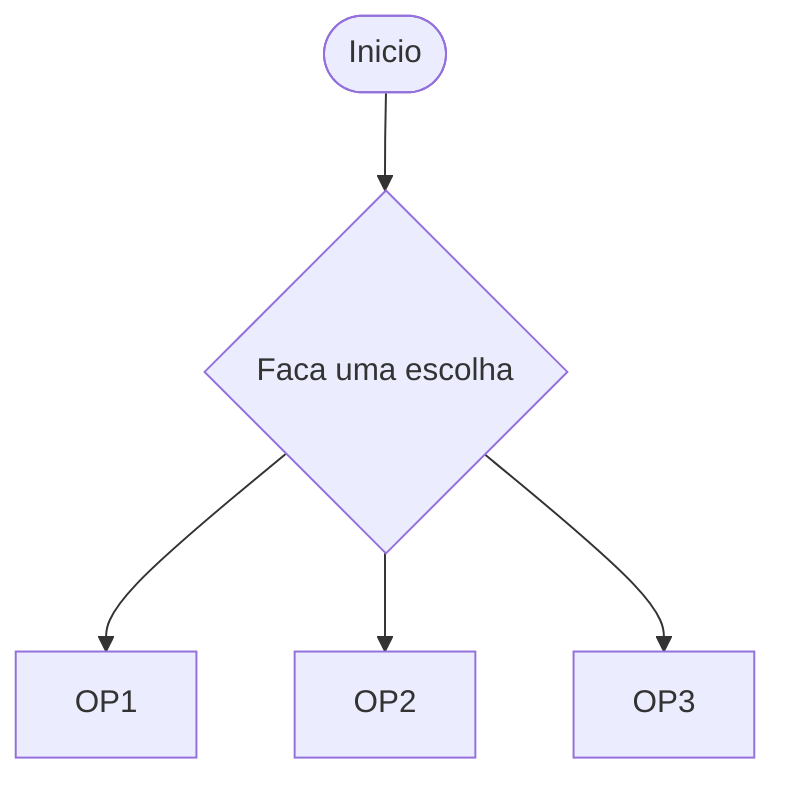
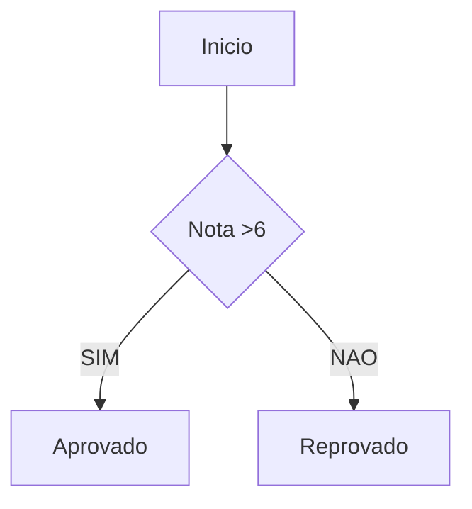
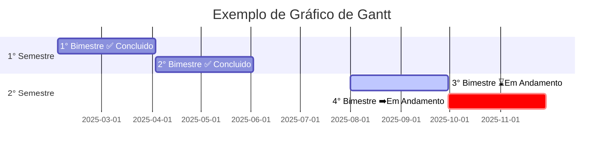

```mermaid
flowchart TD
 
A(["Inicio"])
A --> B{"Faca uma escolha"}
B --> C["OP1"]
B --> D["OP2"]
B --> E["OP3"]
```
 

```mermaid
graph TD;
A[Inicio] --> B{Nota >6};
B --> |SIM| C[Aprovado];
B --> |NAO| D[Reprovado];
```

```mermaid
gantt
    title Exemplo de Gráfico de Gantt
    dateFormat YYYY-MM-DD
    section 1° Semestre
   1° Bimestre ✅ Concluido:a1, 2025-02-02, 60d
   2° Bimestre ✅ Concluido:a2, after a1, 60d
    section 2° Semestre
   3° Bimestre ⌛Em Andamento:active, a3, 2025-08-01, 60d
   4° Bimestre ➡️Em Andamento:crit, a4, after a3,60d
```
